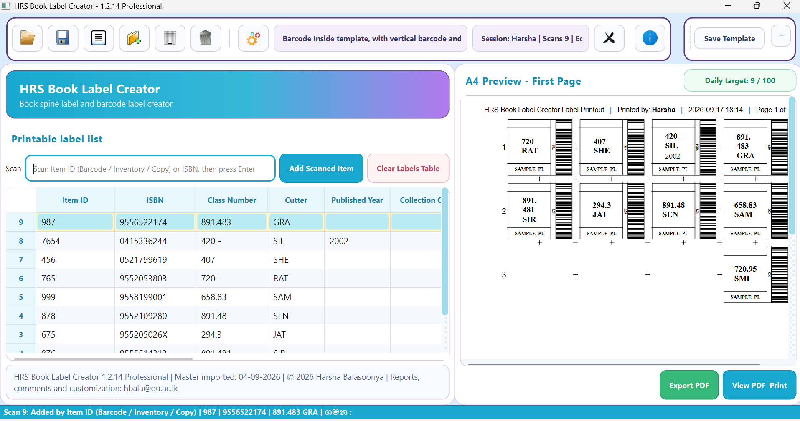
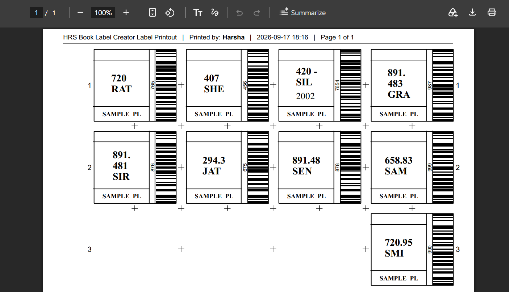

# HRS_SpineSmart
HRS SpineSmart is a free Windows application for creating consistent library spine labels from Koha, Excel, or CSV data. It supports Barcode, Inventory Number, Copy Number, ISBN search, Class/Cutter data, Unicode Sinhala/Tamil/English, PDF export, and SQLite-based large-master handling for low-resource Windows 10/11 PCs. Simple, fast, and practical
## Screenshots
### Main Interface

### Label Preview

